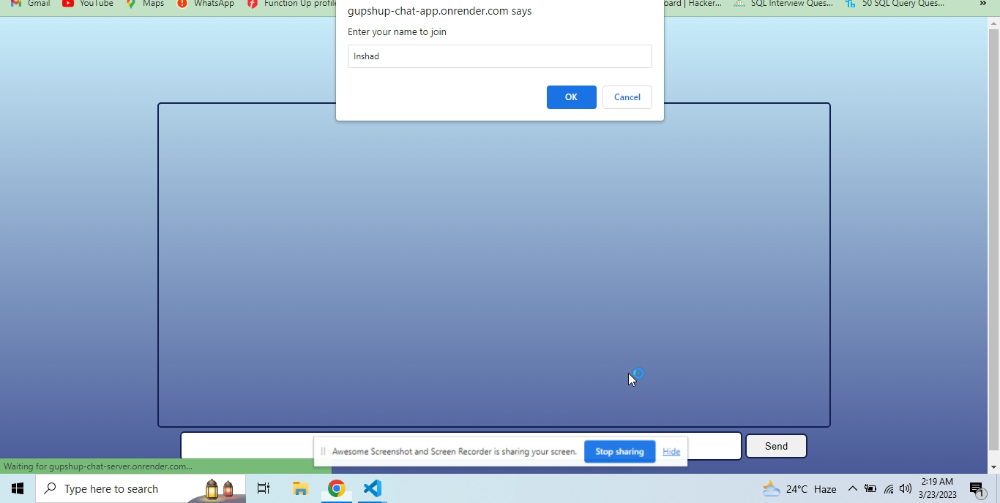
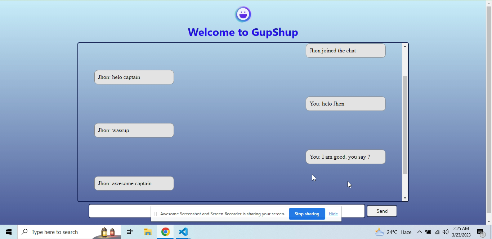

# Project - GupShup Frontened

## Make sure to check Backend Repository :
https://github.com/insh007/GupShup-Server

## Deploy Link :
https://gupshup-chat-app.onrender.com

## Overview
This is a real-time chat application that allows multiple users to communicate with each other in real-time. The application consists of two components: a server built using Node.js and Socket.io, and a client built using HTML, CSS, JavaScript, and Socket.io.

The server component is responsible for handling client connections and broadcasting messages to all connected clients. The client component allows users to enter a username, send and receive messages in real-time.

Overall, this real-time chat application provides a simple, yet powerful way for users to communicate with each other in real-time, making it ideal for a variety of use cases such as online gaming, remote collaboration, and social networking.

## Screenshots
The following screenshots provide a visual representation of the app:

###### Screenshot 1

<br>
<br>
<br>

###### Screenshot 2

<br>
<br>
<br>

## Demo
A live demo of the application can be found at https://gupshup-chat-app.onrender.com.

## Getting Started
#### Installation
1. Clone the repository:

```
git clone https://github.com/insh007/GupShup-Client.git
```

2. Open index.html in your web browser.

## Usage
To use the chat application, follow these steps:

1. Enter a username
2. Click the "Ok" button.
3. Type a message in the input field and press send.

## Technologies
1. HTML
2. CSS
3. JavaScript
4. Socket.io

## Contributing
If you would like to contribute to this project, please open an issue or submit a pull request.